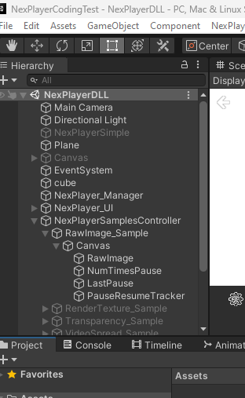
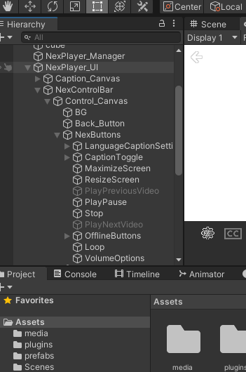
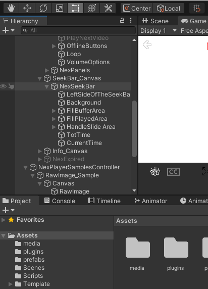

# NexPlayerTest

Author: Nobutaka Kim

Please open the scene NexPlayerDLL, and you will see the following:

{width="3.2506944444444446in"
height="5.281944444444444in"}

Here you can see NumTimesPause, LastPause and Empty Game Object
PauseResumeTracker.

{width="3.6569444444444446in"
height="5.521527777777778in"}

Just a screenshot of the PlayPause button I reference in my script.

{width="4.292361111111111in"
height="5.959027777777778in"}

And another screenshot of the CurrentTime Game Object I reference in my
script.

My Unity version is 2020.3.34f1 on Windows.

I had to rebuild the DLL for x64 as I first built it for x86.

